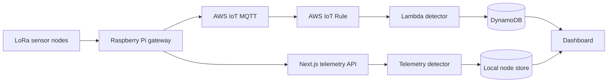

<div align="center">

# Mine Subsidence AI

### Real-time mine safety monitoring from sensor to dashboard

Monitor ground movement, inspect node health, and act on risk signals from one focused operations dashboard.

<p>
  <a href="https://github.com/vedantachari/mine-subsidance-AI"></a>
  
  
  
</p>

<a href="https://github.com/vedantachari/mine-subsidance-AI">
  
</a>

</div>

## Why this exists

Mine environments need an early signal when movement patterns change. Mine Subsidence AI turns sensor readings into a clear operational view: where nodes are located, which ones need attention, and why their status changed.

## At a glance

| Monitor | Understand | Respond |
| --- | --- | --- |
| Node locations on a 2D/3D map | Risk score and status | Search and filter nodes |
| Battery, RSSI, SNR, and freshness | Tilt change and trend signals | Open node history and alerts |
| Active warning and critical nodes | Network health | Forward readings from a gateway |

## How it works



1. Sensors collect movement and environmental readings in the mine.
2. The Raspberry Pi gateway forwards accepted readings to AWS IoT and optionally to the local website API.
3. The telemetry detector compares each reading with the node's history.
4. The app calculates risk using tilt change, z-scores, EWMA, CUSUM, persistence, and freshness.
5. The dashboard refreshes node and summary data every five seconds.
6. Operators use the map, filters, alerts, and node history to investigate changes.

## Quick start

**Requirements:** Node.js 20+ and npm.

```bash
git clone git@github.com:vedantachari/mine-subsidance-AI.git
cd mine-subsidance-AI
npm install
npm run dev
```

Open [http://localhost:3000](http://localhost:3000). Local development uses mock telemetry unless AWS mode is enabled.

Run the project checks:

```bash
npm run lint
npm run build
```

## Telemetry API

Send a compact gateway reading to the ingestion endpoint:

```text
POST /api/telemetry
Content-Type: application/json
```

```json
{
  "n": "NODE_024",
  "la": 18.6007,
  "lo": 73.9306,
  "r": 0.82,
  "p": 0.44,
  "v": 0.041,
  "pk": 0.12,
  "pp": 0.19,
  "f": 18.36,
  "rssi": -67,
  "snr": 8.2,
  "battery": 87,
  "received_at": "2026-09-06T08:10:15Z"
}
```

| Endpoint | Use |
| --- | --- |
| `POST /api/telemetry` | Ingest a gateway reading |
| `GET /api/dashboard` | Load summary cards and active alerts |
| `GET /api/nodes` | List current nodes |
| `GET /api/nodes/:nodeId` | Inspect one node |
| `GET /api/nodes/:nodeId/history` | Load node telemetry history |
| `GET /api/nodes/search?q=...` | Search nodes |

## Connect a Raspberry Pi gateway

Install the gateway dependencies from [`gateway/requirements.txt`](gateway/requirements.txt), then configure the Pi:

```bash
export WEBSITE_API_URL="http://YOUR_COMPUTER_LAN_IP:3000"
export WEBSITE_API_TOKEN="use-the-same-private-token-as-the-website"
python gateway.py
```

The gateway publishes LoRa packets to AWS IoT and asynchronously forwards them to the website. Keep API tokens, certificates, private keys, and AWS credentials out of browser code and source control.

## Enable AWS cloud mode

Add these server-only values to `.env.local`:

```env
AWS_DYNAMODB_ENABLED=true
AWS_REGION=ap-south-1
DYNAMODB_NODES_TABLE=mine-nodes
DYNAMODB_HISTORY_TABLE=mine-telemetry-history
```

Provision the cloud path:

1. Create `mine-nodes` with partition key `node_id` (String).
2. Create `mine-telemetry-history` with partition key `node_id` (String) and sort key `received_at` (String).
3. Deploy [`aws/lambda/telemetry-handler.ts`](aws/lambda/telemetry-handler.ts) with write access to both tables.
4. Create the IoT rule described in [`aws/iot-rule.sql`](aws/iot-rule.sql) for `mine/gateway/nodes/+/telemetry`.
5. Allow the rule to invoke Lambda and restart the app with `npm run dev:network`.

The local `/api/telemetry` bridge remains available for LAN testing.

<details>
<summary><strong>Project structure</strong></summary>

```text
src/app/          Next.js pages and API routes
src/components/   Dashboard, map, alerts, and node UI
src/hooks/        Polling and dashboard data hooks
src/lib/          Telemetry storage, scoring, and status logic
src/types/        Shared telemetry and API types
aws/              DynamoDB, IoT, IAM, and Lambda examples
gateway/          Raspberry Pi LoRa-to-cloud bridge
public/           Static assets and dashboard screenshot
```

</details>

## Built with

Next.js 16 · React 19 · TypeScript · Leaflet · MapLibre GL · Three.js · AWS IoT · DynamoDB

## Project status

This is a mine monitoring prototype and demonstration. Validate sensor calibration, alert thresholds, network reliability, and deployment permissions before using it for operational safety decisions.
