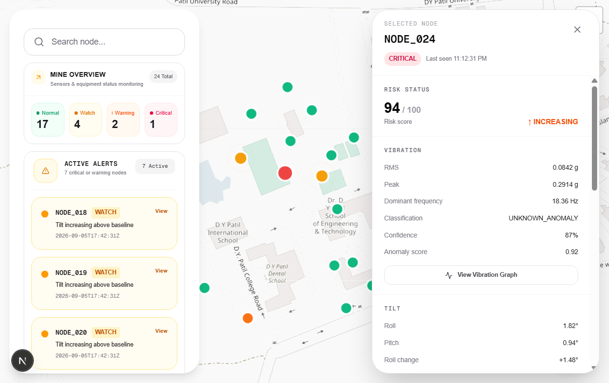

# Mine Subsidence Dashboard

## Gateway telemetry integration

The admin app accepts normalized or compact gateway telemetry at:

```text
POST /api/telemetry
Content-Type: application/json
```

Example payload:

```json
{
	"n": "NODE_024",
	"la": 18.6007,
	"lo": 73.9306,
	"r": 0.82,
	"p": 0.44,
	"v": 0.041,
	"pk": 0.12,
	"pp": 0.19,
	# Mine Subsidence AI Dashboard

	An operations dashboard for monitoring mine sensor nodes, detecting possible ground movement, and reviewing telemetry in near real time. It combines a map, node status cards, active alerts, network health, and node history in one screen.

	

	## What it does

	- Shows every monitored node on a 2D or 3D map.
	- Groups nodes by health: normal, warning, critical, or offline.
	- Displays active alerts, battery, signal quality, and last-seen time.
	- Searches and filters nodes from the dashboard.
	- Scores incoming telemetry using tilt change, z-scores, EWMA, CUSUM, persistence, and freshness.
	- Supports local mock data, a Raspberry Pi gateway, and AWS IoT plus DynamoDB.

	## How the system works

	```mermaid
	flowchart LR
			A[LoRa sensor nodes] --> B[Raspberry Pi gateway]
			B --> C[AWS IoT MQTT]
			B --> D[Next.js telemetry API]
			C --> E[AWS IoT Rule]
			E --> F[Lambda telemetry handler]
			F --> G[(DynamoDB)]
			D --> H[Telemetry detector]
			H --> I[(In-memory node store)]
			G --> J[Next.js dashboard]
			I --> J
	```

	### In simple terms

	1. Sensors measure movement and environmental values in the mine.
	2. The gateway forwards each reading to AWS IoT and, when configured, to the website API.
	3. The detector compares each reading with the node's previous readings.
	4. The app calculates a risk score and status for each node.
	5. The dashboard polls the latest nodes and telemetry every five seconds.
	6. Operators use the map, filters, alerts, and node details to investigate changes.

	## Run locally

	Requirements: Node.js 20+ and npm.

	```bash
	npm install
	npm run dev
	```

	Open [http://localhost:3000](http://localhost:3000).

	Run the checks with:

	```bash
	npm run lint
	npm run build
	```

	Local development uses mock data unless AWS mode is enabled. Keep secrets in `.env.local`; it is ignored by Git.

	## Telemetry API

	The ingestion boundary is:

	```text
	POST /api/telemetry
	Content-Type: application/json
	```

	Example compact gateway payload:

	```json
	{
		"n": "NODE_024",
		"la": 18.6007,
		"lo": 73.9306,
		"r": 0.82,
		"p": 0.44,
		"v": 0.041,
		"pk": 0.12,
		"pp": 0.19,
		"f": 18.36,
		"rssi": -67,
		"snr": 8.2,
		"battery": 87,
		"received_at": "2026-09-06T08:10:15Z"
	}
	```

	The dashboard reads data from:

	| Endpoint | Purpose |
	| --- | --- |
	| `POST /api/telemetry` | Accept a gateway reading |
	| `GET /api/dashboard` | Return dashboard summary data |
	| `GET /api/nodes` | List current nodes |
	| `GET /api/nodes/:nodeId` | Return one node and its status |
	| `GET /api/nodes/:nodeId/history` | Return node telemetry history |
	| `GET /api/nodes/search?q=...` | Search nodes |

	## Raspberry Pi gateway

	Install the gateway dependencies from `gateway/requirements.txt`, then configure the Pi:

	```bash
	export WEBSITE_API_URL="http://YOUR_COMPUTER_LAN_IP:3000"
	export WEBSITE_API_TOKEN="use-the-same-private-token-as-the-website"
	python gateway.py
	```

	The gateway publishes accepted LoRa packets to AWS IoT and asynchronously forwards them to the website. Keep the token, certificates, and private keys out of browser code and source control.

	## AWS cloud mode

	Set these server-only values in `.env.local`:

	```env
	AWS_DYNAMODB_ENABLED=true
	AWS_REGION=ap-south-1
	DYNAMODB_NODES_TABLE=mine-nodes
	DYNAMODB_HISTORY_TABLE=mine-telemetry-history
	```

	Provision the resources as follows:

	1. Create `mine-nodes` with partition key `node_id` (String).
	2. Create `mine-telemetry-history` with partition key `node_id` (String) and sort key `received_at` (String).
	3. Deploy `aws/lambda/telemetry-handler.ts` with permission to write to both tables.
	4. Create an AWS IoT Rule from `aws/iot-rule.sql` for `mine/gateway/nodes/+/telemetry`.
	5. Allow the rule to invoke Lambda and restart the app with `npm run dev:network`.

	The local `/api/telemetry` bridge remains useful for LAN testing. AWS credentials should come from an IAM role or server environment, never from client components.

	## Project layout

	```text
	src/app/          Next.js pages and API routes
	src/components/   Dashboard, map, alerts, and node UI
	src/hooks/        Polling and dashboard data hooks
	src/lib/          Telemetry storage, scoring, and status logic
	src/types/        Shared telemetry and API types
	aws/              DynamoDB, IoT, IAM, and Lambda examples
	gateway/          Raspberry Pi LoRa-to-cloud bridge
	public/           Static assets and dashboard screenshot
	```

	## License

	This project is intended for the mine monitoring prototype and demonstration.
